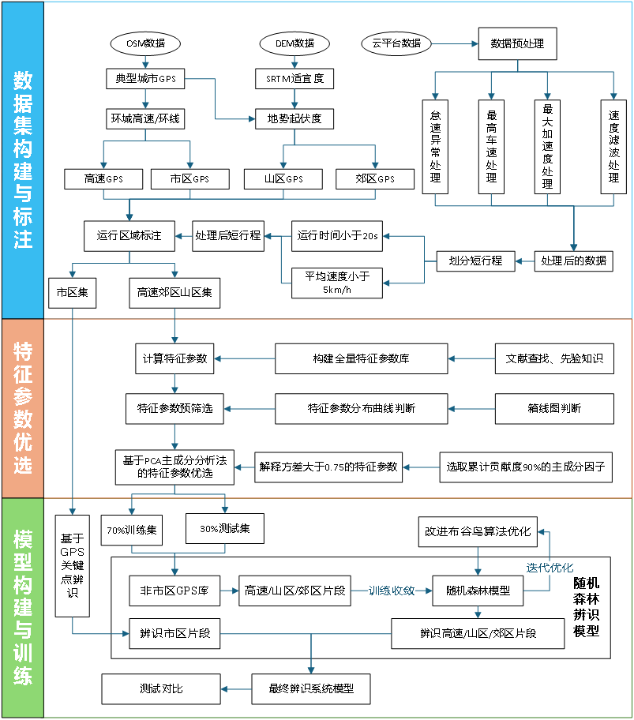
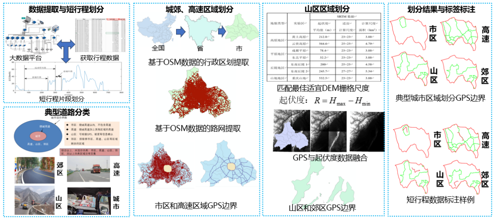
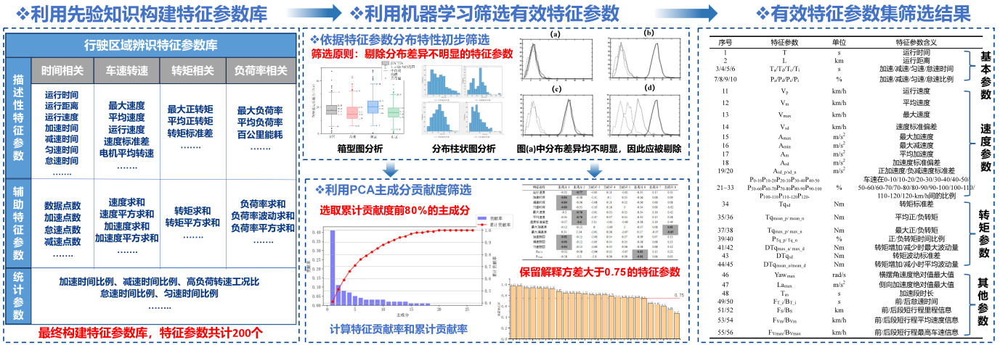
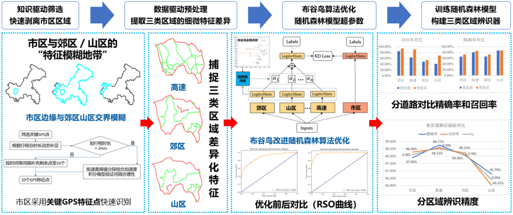

# Subdivided-Region-Identification-System-Based-on-Vehicle-Operation-Characteristic-Parameters

> **Category**: AI Innovation Application / Vehicle Engineering Interdisciplinary  
> **Core Metrics**: Identification Accuracy **97.91%** | Feature Reduction **200→56** | Labeling Cost Reduction **80%+**

## 📖 Project Background & Pain Points

As the automotive industry transitions towards green and low-carbon development, vehicle manufacturers face higher requirements for **component reliability verification** and **energy management strategies**. Traditional identification of vehicle operation areas (Urban, Highway, Suburban, Mountain) faces several critical bottlenecks:

* **High Labeling Cost**: Reliance on manual labeling is time-consuming and inefficient.
* **Low Accuracy**: Traditional models prone to misclassification in "fuzzy boundary" zones (e.g., Suburban vs. Mountain).
* **Weak Explainability**: "Black box" deep learning models lack the transparency required for engineering traceability.

To address these challenges, this project proposes a **"Data Support - Feature Optimization - Intelligent Identification"** trinity framework[cite: 8], achieving low-cost, high-precision fine-grained area identification.

---

## 🏗️ Core Technical Architecture

The project adopts a **Phased Progressive** technical route, consisting of three core modules:

  
   
  <em>Figure 1: flowchart</em>

### 1. Data Layer: Offline Dataset Construction via Open Source GIS

  
   
  <em>Figure 2: Offline Dataset Construction</em>

Instead of relying on expensive commercial map APIs, we constructed a high-precision offline label library using open-source data[cite: 28, 33, 34].
* **Data Sources**: Integrated **OSM (OpenStreetMap)** road data and **SRTM3-90m DEM** elevation data.
* **Zoning Logic**:
    * **Urban**: Defined by ring roads or beltways.
    * **Highway**: Extracted highway elements based on road attributes.
    * **Mountain**: Calculated based on Terrain Ruggedness Index ($R = H_{max} - H_{min}$); areas with $R \ge 200m$ are defined as mountainous.
    * **Suburban**: The remaining areas excluding the above.
* **Outcome**: Built a labeled offline dataset covering **6 typical cities** and **24,000 short-trip segments**, with GPS boundary error $\le 50m$.

### 2. Feature Layer: Two-Stage Feature Optimization Mechanism

  
   
  <em>Figure 3:  Feature Optimization</em>

A dual-screening funnel was designed to filter **56 optimal features** from an initial set of 200 parameters.
* **Stage 1 (Visual Screening)**: utilized **Box Plots** and **Distribution Curves** to identify and eliminate "dead features" (e.g., parking counts) that showed high overlap across all four regions.
* **Stage 2 (Statistical Refinement)**: Based on **Principal Component Analysis (PCA)** Load Matrix.
    * Criterion 1: Principal components with cumulative contribution $\ge 80\%$.
    * Criterion 2: Explained variance (loading absolute value) $> 0.75$ on principal components.

### 3. Model Layer: Data-Knowledge Dual-Drive Model

  
   
  <em>Figure 4:  Model </em>

A progressive identification logic was developed to resolve the confusion between "Urban" and "Suburban/Mountain" features.

| Drive Type | Target Object | Core Logic | Technical Carrier |
| :--- | :--- | :--- | :--- |
| **Knowledge-Driven** 🧠 | **Urban** (Easy) | Fast stripping based on prior rules & geo-boundaries | ArcGIS Key GPS Feature Point Matching |
| **Data-Driven** 💻 | **Highway/Suburban/Mountain** (Hard) | Mining subtle feature differences for precise classification | **Cuckoo Search (CS)** optimized **Random Forest (RF)** |

> **Optimization Highlight**: The **Cuckoo Search** algorithm is used to optimize Random Forest hyperparameters (e.g., `n_estimators`, `max_depth`), achieving faster convergence and higher accuracy compared to Grid Search.

---

## 📊 Experimental Results & Performance

Validated using **179,006** real-world driving data segments from a big data platform.

### 1. Optimization Comparison
The CS-optimized Dual-Drive architecture significantly outperformed the baseline model:

| Metric | Baseline RF (Original) | **Optimized Model (Ours)** | Improvement |
| :--- | :--- | :--- | :--- |
| **Accuracy** | 67.09% | **97.91%** | 🔺 +30.8% |
| **F1-Score** | 0.740 | **0.981** | 🔺 +0.24 |

### 2. Fine-Grained Performance
Successfully resolved the difficult "Mountain vs. Suburban" confusion problem:

* **Highway**: Precision **98.77%** (Most stable features)
* **Urban**: Precision **97.90%**
* **Suburban**: Precision **98.06%**
* **Mountain**: Precision **96.79%**

---